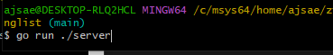
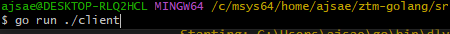

# Mailing List Microservice

  

# Setup

This project requires a `gcc` compiler installed and the `protobuf` code generation tools.

## Install protobuf compiler

Install the `protoc` tool using the instructions available at [https://grpc.io/docs/protoc-installation/](https://grpc.io/docs/protoc-installation/).

Alternatively you can download a pre-built binary from [https://github.com/protocolbuffers/protobuf/releases](https://github.com/protocolbuffers/protobuf/releases) and placing the extracted binary somewhere in your `$PATH`.

## Install Go protobuf codegen tools

`go install google.golang.org/protobuf/cmd/protoc-gen-go@latest`

`go install google.golang.org/grpc/cmd/protoc-gen-go-grpc@latest`

## Run both servers and make requests with the client

Once you have set up your environment, you can clone the repository in your machine. Open two terminals and navigate to the project folder on both.

The client has code to make requests to the server, if you want to make more requests, go to clietn/client.go and uncomment the requests right at the bottom and run the client on you terminal again.

